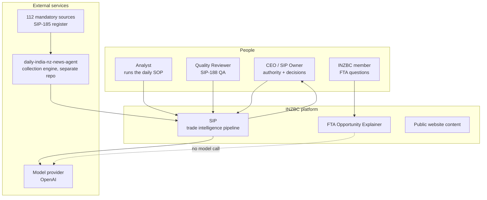
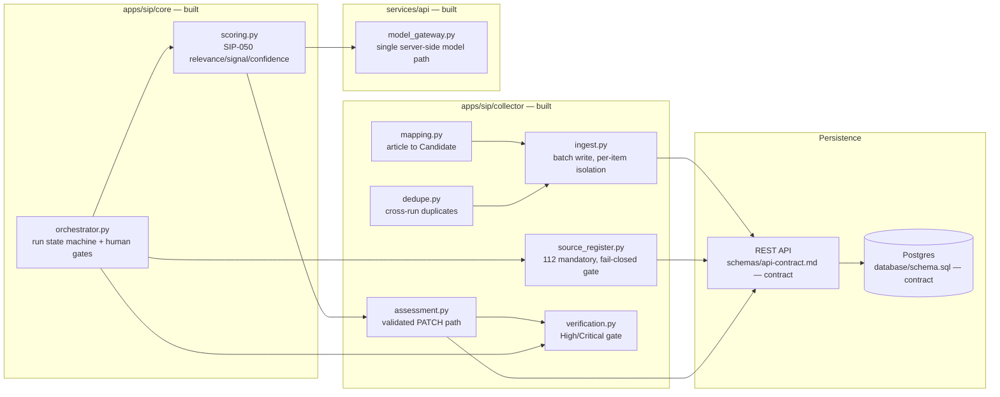
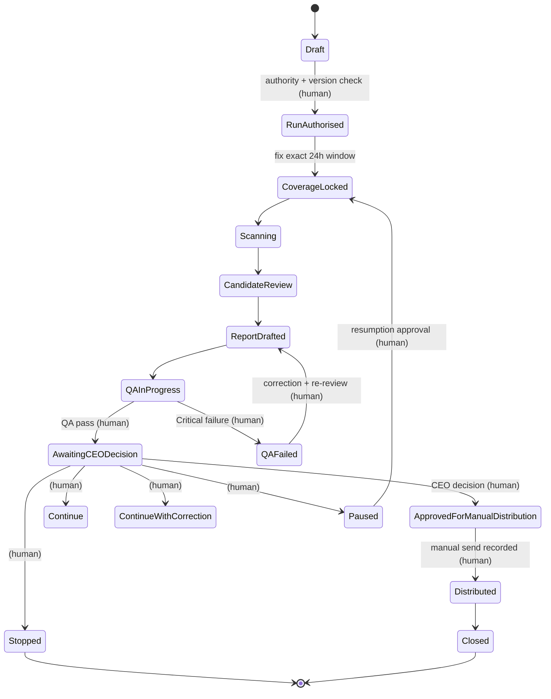
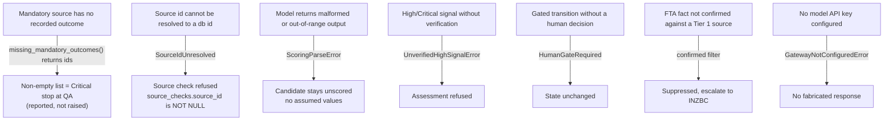
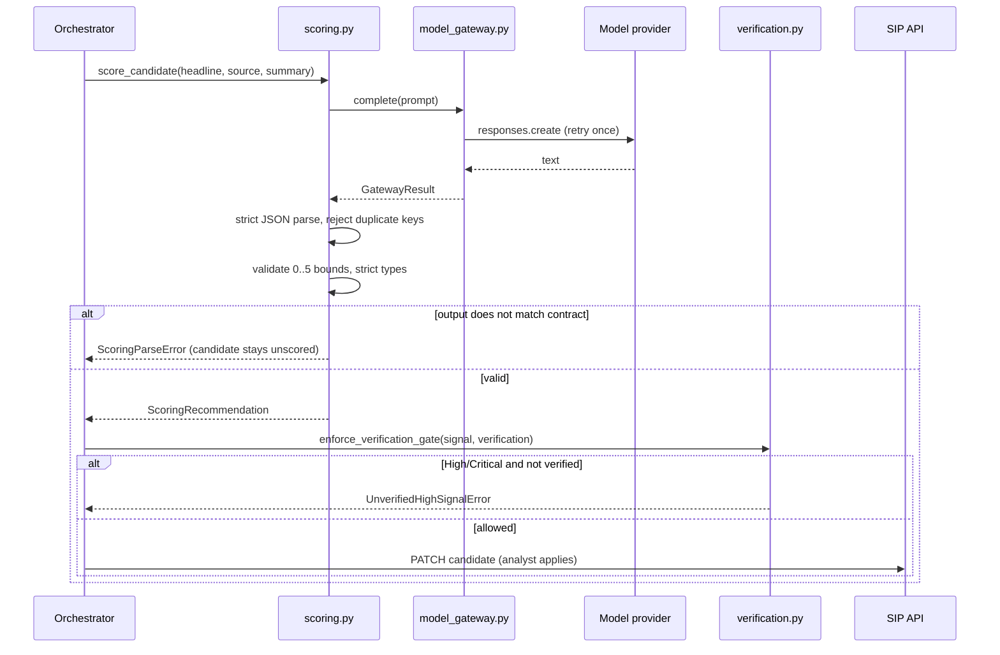
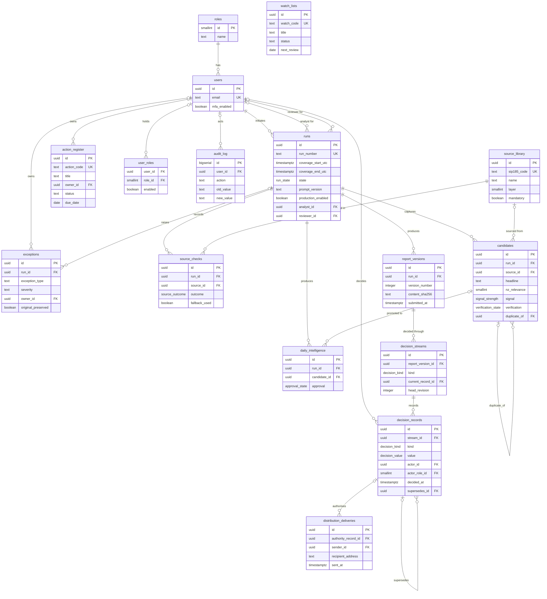
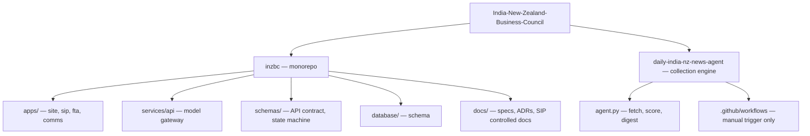
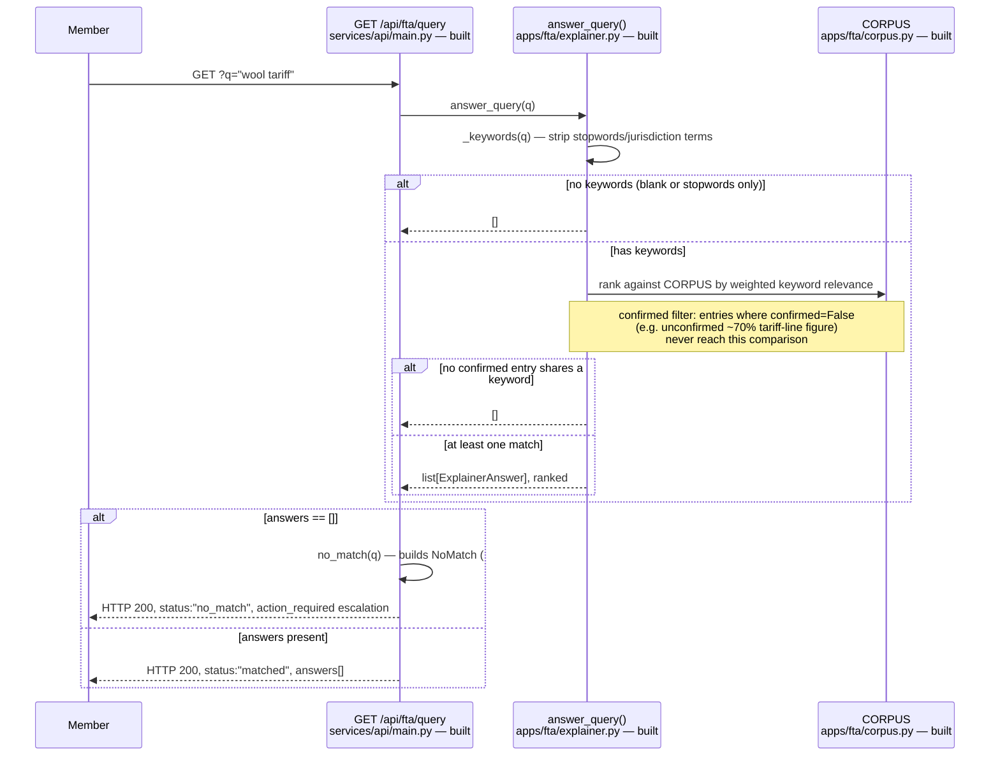
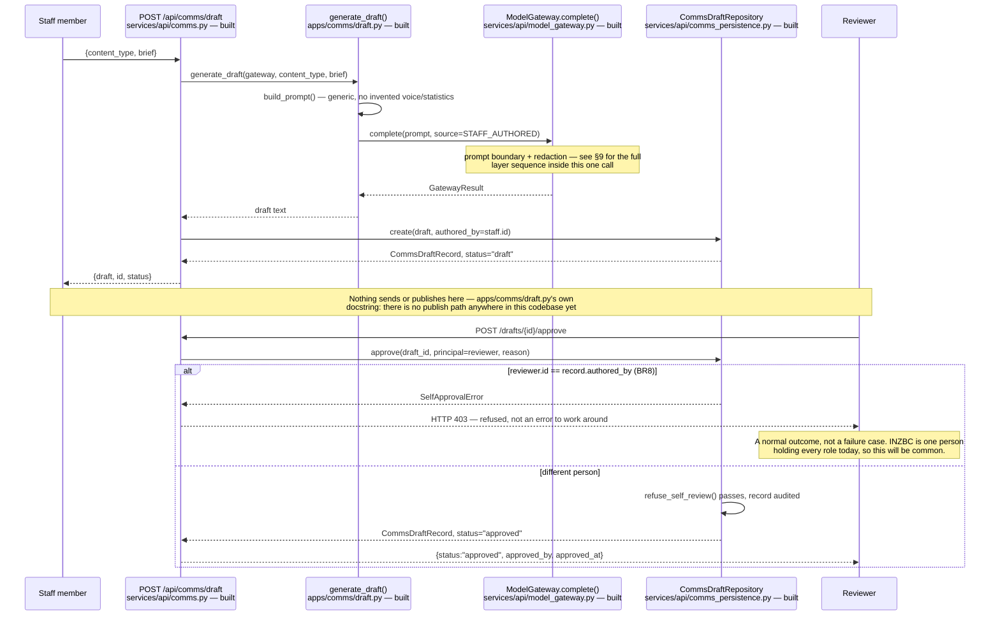
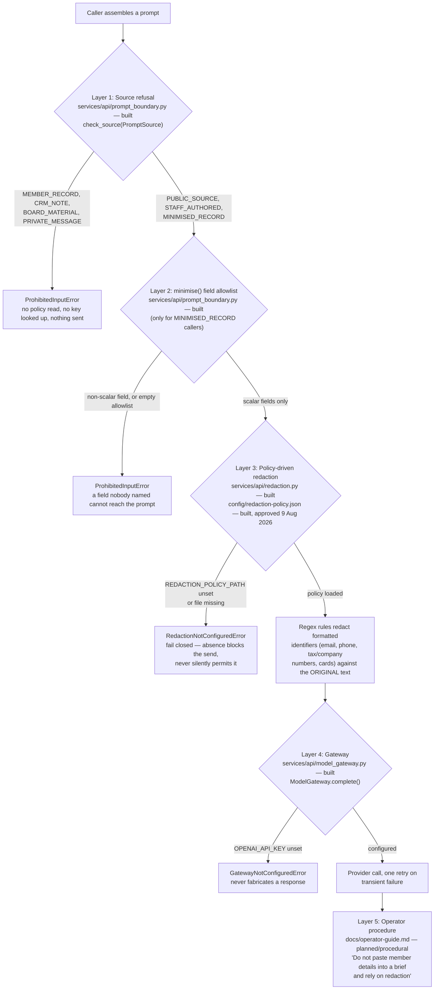

# INZBC platform architecture

System diagrams for the INZBC AI Operating System. Diagrams are Mermaid so they version with the
code and render on GitHub. Update them in the same pull request as the change they describe.

Status is marked on every component: **built** (merged, tested), **contract** (specified, not yet
implemented) or **planned** (decided, not started). Nothing here is aspirational — if it says built,
there is code and tests behind it.

---

## 1. System context

Who and what the platform talks to.

The FTA Explainer deliberately makes **no model call** — it answers only from a sourced corpus, so
it cannot hallucinate a trade fact.

---

## 2. SIP pipeline components

---

## 3. Run state machine

The SIP-184 daily run. Run state is mutated in exactly one place: `RunRepository.apply_transition`
(`services/api/persistence.py`), which issues the compare-and-swap
`update runs set state = ..., version = version + 1 where id = ... and version = ...`.

That is not a bypass of the state machine. `persistence.py` imports `is_legal_transition` and
`is_human_gated` from `apps/sip/core/orchestrator.py` and refuses an illegal jump, or a gated
transition with no approval, before it writes. `Orchestrator.advance()` enforces the same table
in memory and is exercised by the tests and by audit-log replay; it has no production callers
today, so it is the second implementation of the rule rather than the path that applies it.

Transitions labelled **(human)** below require a decision recorded in `decision_records`, named by
`approval_ref`. An agent can never cross them alone.

`Stopped` is terminal for that run id — a stopped run is never resumed under the same id.

---

## 4. Fail-closed controls

Where the platform refuses rather than guesses. Each is enforced in code and covered by tests.

Two different mechanisms appear below, and the distinction matters. Most of these **raise** and so
refuse the operation outright. The mandatory-source check is a **reporting** control:
`missing_mandatory_outcomes()` returns the list of uncovered source ids and raises nothing. It is the
QA step (SIP-188) that must treat a non-empty list as a Critical stop. The code surfaces the gap; the
gate is procedural.

---

## 5. Scoring and verification sequence

The path a candidate takes from capture to an applied assessment.

`to_assessment()` never sets `verification` — verification is evidence-driven and human-owned, so the
fail-closed gate stays in charge of High and Critical.

---

## 6. Data model

Entity relationships from `database/schema.sql` (contract stage — not yet migrated).

Two constraints the diagram cannot show, both enforced in the schema:
- `runs` has a check that `analyst_id <> reviewer_id` — nobody reviews their own run.
- `source_checks` has `unique (run_id, source_id)` — one outcome per source per run.

---

## 7. Repository layout

The collection engine stays a separate repository: it has its own release cadence and runs the live
daily digest, while `inzbc` holds the platform and the controlled documentation.

---

## 8. Service flow diagrams (#331)

Two service flows, both encoding a refusal that is the whole point of the service. Neither
refusal was visible anywhere in the documentation before this section.

> **Note on source doc.** #331 points to `docs/architecture-diagram-plan.md` for "standard and
> full diagram set" — that file does not exist anywhere in this repository's history. This
> section instead extends this file, per #331's own "new file, or extend the SIP file — your
> call, note which in the PR" instruction, matching the Mermaid/status-tag convention the rest
> of this file already uses.

### 8.1 FTA query flow

`answer_query()` from request to response — `apps/fta/explainer.py` (built) called from
`GET /api/fta/query` — `services/api/main.py` (built).

**No model call anywhere in this path.** `answer_query()` matches against a curated, pre-sourced
corpus and returns an escalation when nothing confirmed matches — it cannot hallucinate a trade
fact because it contains no code path that generates text. That is a structural property of the
module, not a prompt instruction that could be bypassed.

**Why a no-match is HTTP 200, not 404.** `services/api/main.py`'s `fta_query()` docstring states
it directly: a 404 would push callers toward an error branch that discards the guidance. A
no-match here is a legitimate outcome with its own payload (the Action Required escalation
path), not a failure of the request — so it gets a success status with a status field, the same
way `NoMatch` (built, `apps/fta/explainer.py`) is a distinct type from `ExplainerAnswer` rather
than an exception.

**What this diagram does not cover:** the `answer_query_at_depth()` public/member/internal split
(#187, in review as of this diagram) — `/api/fta/query` still calls the single-audience
`answer_query()` shown above; ranking internals (weighted keyword scoring, tie-breaking) — see
`apps/fta/explainer.py`'s own docstrings; and the FTA UI's rendering of the response, which is
Paras's lane.

### 8.2 Comms draft-to-approve flow

The draft path through `apps/comms/draft.py` (built) and its persistence/approval layer in
`services/api/comms.py` / `services/api/comms_persistence.py` (built).

**The self-approval refusal (BR8, `services/api/comms_persistence.py`) is drawn as a normal
branch, not an error path**, because it is expected to fire routinely: INZBC currently has one
person capable of holding every role, so an attempted self-approval is an everyday occurrence
the flow must handle gracefully, not an edge case.

**What this diagram does not cover:** the redaction/prompt-boundary internals inside
`ModelGateway.complete()` — see §9; the streaming SSE variant (#65, unbuilt); the review UI
(#60, Paras's lane) that would actually present this to a reviewer; and what happens after
`status="approved"` — there is no send/publish step in this codebase, by design, so the flow
ends at approval.

## 9. Model data boundary — defence-in-depth (#332)

Every layer untrusted text passes through before it can reach an external model. ADR-0006's
own reasoning: rule-based redaction structurally cannot catch a name, title or employer written
in prose, so the primary control moved to refusing the *source* rather than trying to clean the
*text*. Reconstructing that argument today means reading four files; this section is that
reconstruction.

**What each layer cannot do, not only what it catches** (a layer documented only by its
successes reads as a guarantee, which is the failure mode ADR-0006 exists to prevent):

- **Layer 1 (source refusal)** cannot verify a caller's declaration — `PromptSource` is *stated*,
  not checked against the actual data. A caller that mislabels `MEMBER_RECORD` text as
  `STAFF_AUTHORED` is not caught here. What it does guarantee: a new call site cannot omit the
  question, since `complete()` has no default source.
- **Layer 2 (`minimise()`)** cannot inspect what is *inside* a permitted scalar field — a `str`
  holding serialised JSON with a name embedded in it passes, because the caller allowlisted that
  field. **Known gap, stated rather than hidden: no module builds prompts through `minimise()`
  yet** — no caller assembles from raw member records today, so this is the rule the first one
  must follow, not a control currently running.
- **Layer 3 (redaction)** cannot catch a name, job title, or employer in ordinary prose — only
  formatted identifiers (regex-matchable emails, phone numbers, tax/company numbers, cards).
  `Delegation lead: Priya Sharma, Chief Executive, Koru Exports Ltd` passes through this layer
  untouched, stated explicitly in `config/redaction-policy.json`'s own approval comment.
- **Layer 4 (gateway)** cannot un-send a payload once a provider call succeeds — retries only
  cover transient failures, not policy correctness.
- **Layer 5 (operator procedure)** is the only layer that can catch what layers 1-4 structurally
  cannot: prose containing a name. It works only if followed — it is instruction, not code, and
  is marked `planned/procedural` rather than `built` for that reason.

**Fail-closed points**, marked explicitly because this is the property the whole design rests
on: a missing `REDACTION_POLICY_PATH` is a refusal (`RedactionNotConfiguredError`), never
permission to send unredacted text; a missing `OPENAI_API_KEY` is a refusal
(`GatewayNotConfiguredError`), never a fabricated response; an empty `minimise()` allowlist is a
refusal, never "send everything." Every one of these defaults to blocking, not to disclosure.

**What this diagram does not cover:** the audit-log write for a completed call (out of this
module, in `services/api/audit.py`); how a caller decides *which* `PromptSource` applies to its
data — that judgement call lives with the caller, this layer only enforces the declared answer;
and the redaction policy's own rule content (see `config/redaction-policy.json` directly for the
current rule set).

## Related documents
- `schemas/api-contract.md` — endpoint contract
- `schemas/state-machine.md` — the authoritative transition list this encodes
- `database/schema.sql` — data model source
- `docs/decisions/` — architecture decision records
- `docs/sip/launch/` — the controlled SIP operating documents
