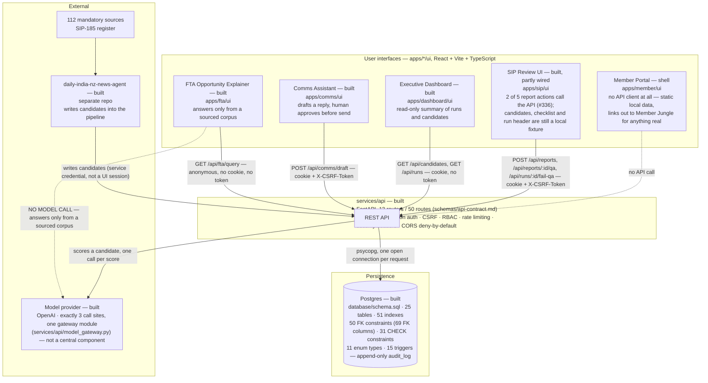
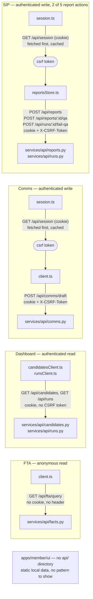
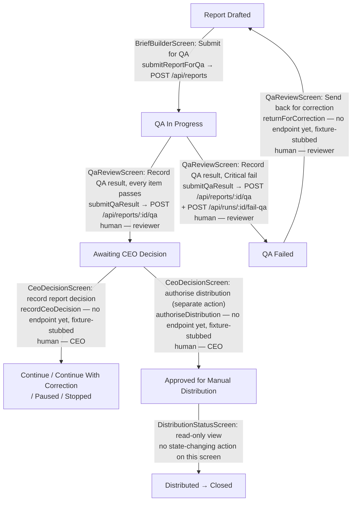

# Container diagram: the whole platform on one page

C4 Level 2. `docs/architecture.md` has a Level 1 context diagram and a Level 3 component diagram
for the SIP pipeline, but no team view — no single page shows every application, the API and the
database together. This is that page. Update it in the same pull request as a change that adds,
removes or re-wires a container.

Status tags match `docs/architecture.md`'s convention: **built** (merged, tested), **contract**
(specified, not yet implemented) or **planned** (decided, not started). A container being *built*
is a statement about the code existing and being tested — not a claim about how much of it talks to
the API. Two of the five UIs below are built but only partly wired; that is called out on the node
itself, not hidden behind the tag.

## What each status means here

- **FTA, Comms, Dashboard** — built and fully wired: every read or write the screen needs goes
  through the API call shown above. Nothing behind these three is a fixture.
- **SIP** — built, but only `submitReportForQa` and `submitQaResult` (`apps/sip/ui/src/api/reportsStore.ts`)
  call a real endpoint. `returnForCorrection`, `recordCeoDecision` and `authoriseDistribution` stay
  fixture-backed because there is no HTTP route for any of the three yet — see that file's doc
  comments for why each one specifically. Everything the analyst sees before submitting for QA
  (candidates, the 112-source register, the run header) is `apps/sip/ui/src/lib/fixtures.ts`, not a
  `GET` call — the API has `GET /api/candidates` and `GET /api/runs` (the Dashboard's own edges
  above prove they work), the SIP UI just doesn't call them yet.
- **Member** — a shell. `apps/member/ui/src` has no `api/` directory at all; nothing on this screen
  can fail to reach the network because nothing on it tries to.

## What this diagram does not cover

- **How** each UI-to-API edge actually authenticates (cookie presence, CSRF header, ordering) —
  that's "UI-to-API integration patterns" below, one level more detailed than a container diagram
  should go.
- **Which SIP screen drives which run-state transition** — that's "SIP screen flow against run
  states" below, since that is a flow within one container, not a relationship between containers.
- Every count on the `services/api` and Postgres boxes — routes, routers, cross-cutting layers,
  tables, indexes, foreign keys, CHECK constraints, enum types, triggers — is sourced from
  `docs/backend-engineering-evidence.md`, including the exact command or query that produced each
  one. Update the evidence document first when a count drifts, then this diagram, not the other way
  round.
- `services/api/decisions.py` (`DecisionRepository.record`, `ReportRepository.record_qa`) is
  business logic the API layer calls into, not a separate container — it has no `APIRouter` of its
  own and is folded into the `services/api` box above.
- Internal module boundaries within `services/api` or `apps/sip` (collector, core, persistence) —
  that's `docs/architecture.md` §2's job, at component level, one level below this page.

## UI-to-API integration patterns

The five interfaces talk to the API in four genuinely different ways, plus one that doesn't talk to
it at all. These are security decisions, not inconsistency: a public read needs no credentials; a
staff write needs both cookie and CSRF token because `SameSite=Lax` alone still permits a
top-level cross-site POST — the shape of a form-submission CSRF — so the token is the control
rather than belt-and-braces (`apps/comms/ui/src/api/session.ts`, `apps/sip/ui/src/api/session.ts`).

Every client file above lives under `apps/<app>/ui/src/api/`. The CSRF path (Comms, SIP) always
fetches `/api/session` before the write, not alongside it — that ordering is the control: the token
comes from a same-origin response an attacker's cross-site request cannot read, so it can only be
learned by a browser that already holds the session cookie for this origin.

Anonymous read (FTA) is a deliberate choice, not a missing control: `GET /api/fta/query` answers
only from the sourced FTA corpus (`docs/architecture.md` §1 — "no model call"), the same information
for every caller, with no write capability behind it. There is nothing a cookie or token would
protect, so requiring one would add friction without adding security.

Dashboard's authenticated read sits between the two: it needs the cookie because run and candidate
data isn't public, but has no CSRF exposure to defend against because it never writes.

## SIP screen flow against run states

Which of the four SIP UI screens (`apps/sip/ui/src/screens/`) drives which `schemas/state-machine.md`
transition, and which of those transitions cannot be crossed without a recorded human decision.
`Draft` through `Candidate Review` have no screen at all — those five states are pipeline/agent-driven
(`apps/sip/core/orchestrator.py`), not something a person moves through this UI.

Every transition drawn above is a human gate — `schemas/state-machine.md` marks every one of them
"(human)" already, none of the four screens can cross one alone, and issue #336's own scope is why
two of the five report actions call a real endpoint while three stay fixture-stubbed: there is no
HTTP route yet for `QA Failed → Report Drafted` or for either CEO decision (ADR-0005 follow-up 4,
pending the client's answer on `decision_role_permissions`) — see `apps/sip/ui/src/api/reportsStore.ts`'s
doc comments on `returnForCorrection`, `recordCeoDecision` and `authoriseDistribution` for the
per-function reasoning.

## Related documents
- `docs/backend-engineering-evidence.md` — every count this diagram's `services/api` and Postgres
  boxes carry, with the command or query that produced it
- `docs/architecture.md` — system context (Level 1) and SIP component diagram (Level 3)
- `schemas/api-contract.md` — the 50-route contract this diagram counts against
- `schemas/state-machine.md` — the authoritative transition list the SIP screen-flow diagram encodes
- `docs/decisions/` — ADR-0004 (session transport), ADR-0005 (decision permissions, the reason
  SIP's decision endpoints aren't mounted)
