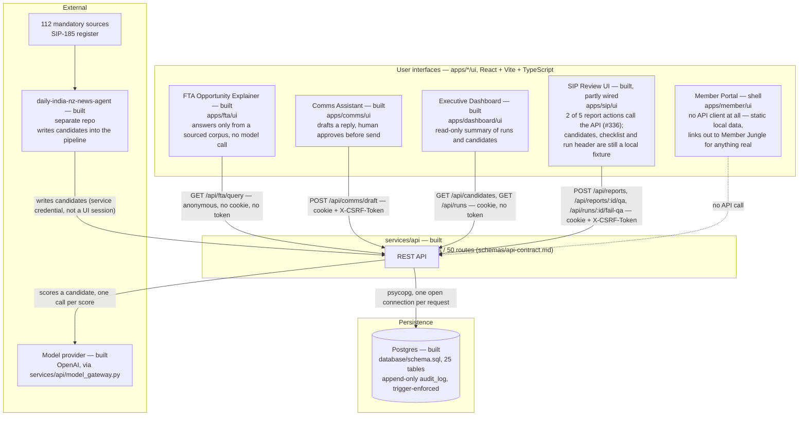

# Container diagram: the whole platform on one page

C4 Level 2. `docs/architecture.md` has a Level 1 context diagram and a Level 3 component diagram
for the SIP pipeline, but no team view — no single page shows every application, the API and the
database together. This is that page. Update it in the same pull request as a change that adds,
removes or re-wires a container.

Status tags match `docs/architecture.md`'s convention: **built** (merged, tested), **contract**
(specified, not yet implemented) or **planned** (decided, not started). A container being *built*
is a statement about the code existing and being tested — not a claim about how much of it talks to
the API. Two of the five UIs below are built but only partly wired; that is called out on the node
itself, not hidden behind the tag.

## What each status means here

- **FTA, Comms, Dashboard** — built and fully wired: every read or write the screen needs goes
  through the API call shown above. Nothing behind these three is a fixture.
- **SIP** — built, but only `submitReportForQa` and `submitQaResult` (`apps/sip/ui/src/api/reportsStore.ts`)
  call a real endpoint. `returnForCorrection`, `recordCeoDecision` and `authoriseDistribution` stay
  fixture-backed because there is no HTTP route for any of the three yet — see that file's doc
  comments for why each one specifically. Everything the analyst sees before submitting for QA
  (candidates, the 112-source register, the run header) is `apps/sip/ui/src/lib/fixtures.ts`, not a
  `GET` call — the API has `GET /api/candidates` and `GET /api/runs` (the Dashboard's own edges
  above prove they work), the SIP UI just doesn't call them yet.
- **Member** — a shell. `apps/member/ui/src` has no `api/` directory at all; nothing on this screen
  can fail to reach the network because nothing on it tries to.

## What this diagram does not cover

- **How** each UI-to-API edge actually authenticates (cookie presence, CSRF header, ordering) —
  that is `docs/architecture/containers.md`'s companion diagram, "UI-to-API integration patterns"
  (#330), one level more detailed than a container diagram should go.
- **Which SIP screen drives which run-state transition** — also #330, since that is a flow within
  one container, not a relationship between containers.
- The 13 routers and 50 routes are counted from `@router.get/post/patch/put/delete` decorators
  across `services/api/*.py` (excluding tests) as of this diagram, not from `schemas/api-contract.md`
  directly — the two should agree; if they don't, the contract doc is the one to trust and this
  count is stale.
- `services/api/decisions.py` (`DecisionRepository.record`, `ReportRepository.record_qa`) is
  business logic the API layer calls into, not a separate container — it has no `APIRouter` of its
  own and is folded into the `services/api` box above.
- Internal module boundaries within `services/api` or `apps/sip` (collector, core, persistence) —
  that's `docs/architecture.md` §2's job, at component level, one level below this page.

## Related documents
- `docs/architecture.md` — system context (Level 1) and SIP component diagram (Level 3)
- `schemas/api-contract.md` — the 50-route contract this diagram counts against
- `docs/decisions/` — ADR-0004 (session transport), ADR-0005 (decision permissions, the reason
  SIP's decision endpoints aren't mounted)
